# Mono Banking MCP Server

[](https://mono-banking-mcp.fastmcp.app/mcp)

A comprehensive **Model Context Protocol (MCP)** server for Nigerian banking operations using the [Mono Open Banking API](https://mono.co). Features integrated webhook support for real-time banking events and seamless deployment on FastMCP Cloud.

## Table of Contents

- [Key Features](#-key-features)
- [Architecture](#️-architecture)
- [Technologies Used](#️-technologies-used)
- [Project Structure](#-project-structure)
- [Webhook Integration](#-webhook-integration)
- [Quick Start](#-quick-start)
- [Usage](#-usage)
- [Available Banking Tools](#️-available-banking-tools)
- [Contributing](#-contributing)

## Key Features

- **Complete Banking Operations** - Account management, payments, BVN verification
- **Real-time Webhooks** - Integrated webhook endpoints for live banking events
- **AI Assistant Ready** - Seamless integration with Claude, ChatGPT, and other AI assistants
- **Cloud Deployment** - Ready for FastMCP Cloud with automatic scaling
- **Enterprise Security** - HMAC signature verification and secure API handling
- **Event Monitoring** - Built-in webhook event storage and debugging tools

## Architecture


## Technologies Used

- **Python 3.12+** - Modern Python with async/await support
- **FastMCP 2.12+** - Simplified MCP server with custom route support
- **Starlette** - ASGI framework for webhook endpoints
- **httpx** - Modern async HTTP client for API communication
- **SQLAlchemy** - Database ORM for webhook event storage
- **Mono Open Banking API v2** - Nigerian banking infrastructure
- **python-dotenv** - Environment variable management
- **uv** - Fast Python package manager (recommended)

## Project Structure

```
mono-banking-mcp/
├── mono_banking_mcp/           # Main package
│   ├── server.py                 # FastMCP server with 12 tools + webhook endpoints
│   ├── mono_client.py            # Mono API client with async httpx
│   └── database.py               # SQLAlchemy database for webhook events storage
├── tests/                     # Comprehensive test suite with webhook integration tests
│   ├── conftest.py               # Test configuration and fixtures
│   └── test_mono_banking.py      # Unit and integration tests
├── pyproject.toml            # Modern Python project configuration (uv-based)
├── uv.lock                   # Dependency lock file with FastMCP 2.12+
├── pytest.ini               # Test configuration and markers
├── Makefile                  # Development workflow automation with webhook commands
├── README.md                 # This comprehensive documentation
└── .env.example              # Environment variables template
```

## Webhook Integration

### Real-time Event Processing

The server includes integrated webhook support for real-time banking events:

```mermaid
graph LR
    A[Mono API] -->|POST /mono/webhook| B[FastMCP Server]
    B -->|HMAC Verify| C[Signature Check]
    C -->|✅ Valid| D[Store Event]
    C -->|❌ Invalid| E[Reject]
    D --> F[SQLite Database]
    F --> G[get_webhook_events Tool]
    G --> H[AI Assistant]
```



###  Key Integration Points

- **`/mono/webhook`** - Webhook endpoint for real-time Mono events
- **`/health`** - Health check endpoint for monitoring

### Supported Webhook Events

- **`account.connected`** - New account linked
- **`account.updated`** - Account information changed
- **`account.unlinked`** - Account disconnected
- **`job.completed`** - Data sync completed
- **`job.failed`** - Data sync failed

### Security Features

- **HMAC-SHA256 Signature Verification** - Ensures webhook authenticity
- **Environment-based Secrets** - Secure credential management
- **Request Validation** - Malformed request rejection
- **Event Storage** - Audit trail for all webhook events

## Quick Start

**Ready to use immediately!** Connect your AI assistant to:

[](https://mono-banking-mcp.fastmcp.app/mcp)

```
https://mono-banking-mcp.fastmcp.app/mcp
```

### Available Endpoints

- **MCP Server**: `https://mono-banking-mcp.fastmcp.app/mcp`
- **Webhook Endpoint**: `https://mono-banking-mcp.fastmcp.app/mono/webhook`
- **Health Check**: `https://mono-banking-mcp.fastmcp.app/health`

## Usage

### Claude Desktop Integration

Add to your Claude Desktop configuration (`~/.config/claude-desktop/config.json`):

```json
{
  "mcpServers": {
    "mono-banking": {
      "command": "npx",
      "args": ["-y", "@modelcontextprotocol/server-fetch", "https://mono-banking-mcp.fastmcp.app/mcp"]
    }
  }
}
```

### Usage Examples

Once connected to an AI assistant (Claude, Gemini, etc.), you can use natural language commands:

#### Account Management
- *"List all my linked bank accounts"*
- *"Show me the balance for account abc123"*
- *"Get detailed information for my GTBank account"*
- *"Show me the last 20 transactions for account xyz789"*

#### Payment Operations
- *"Verify the account name for 0123456789 at GTBank (code 058)"*
- *"Initiate a payment of ₦5000 to account 1234567890 at Access Bank for John Doe"*
- *"Check the status of payment reference PAY_ABC123"*

#### Banking Information
- *"Show me all supported Nigerian banks and their codes"*
- *"Look up BVN 12345678901 for identity verification"*
- *"Help a new customer link their bank account"*

#### Complete Workflow Example
1. *"Show me all Nigerian banks"* - Get bank codes
2. *"Verify account 1234567890 at Access Bank"* - Confirm recipient
3. *"Initiate payment of ₦10000 to verified account for rent payment"* - Start payment
4. *"Check payment status for the reference you just gave me"* - Verify completion

## Available Banking Tools

The server provides these comprehensive banking tools (**12 total**):

### Core Banking Operations
| Tool | Description | Parameters |
|------|-------------|------------|
| `list_linked_accounts` | List all linked bank accounts | None |
| `get_account_balance` | Get current account balance | `account_id` |
| `get_account_info` | Get basic account information | `account_id` |
| `get_account_details` | Get comprehensive account details including BVN | `account_id` |
| `get_transaction_history` | Retrieve transaction records with pagination | `account_id`, `limit`, `page` |
| `verify_account_name` | Verify recipient account details before payments | `account_number`, `bank_code` |
| `initiate_payment` | Start a payment via Mono DirectPay | `amount`, `recipient_account_number`, `recipient_bank_code`, customer info |
| `verify_payment` | Check payment status using reference | `reference` |
| `get_nigerian_banks` | List all supported Nigerian banks with codes | None |
| `lookup_bvn` | Perform BVN identity verification | `bvn`, `scope` |
| `initiate_account_linking` | Start account linking process for new customers | `customer_name`, `customer_email` |

## Contributing

Contributions to the Mono Banking MCP Server are welcome! For questions or help getting started, please open an issue.

### Development Workflow

**Quick Start for Contributors:**
```bash
# Fork and clone the repository
git clone https://github.com/YOUR_USERNAME/mono-banking-mcp.git
cd mono-banking-mcp

# Set up development environment
uv sync
uv pip install -e .

# Verify installation with webhook support
python -c "from mono_banking_mcp.server import mcp; print('✅ Package installed successfully')"

# Run comprehensive tests
make test-all

# Create feature branch and start developing
git checkout -b feature/your-feature-name

# Test your changes
make test-webhook  # Test webhook functionality
make tools         # Verify all 12 tools are working
```
