# Mono Banking MCP Server

A comprehensive **Model Context Protocol (MCP)** server for Nigerian banking operations using the [Mono Open Banking API](https://mono.co).

## � Table of Contents

- [Key Features](#-key-features)
- [Architecture](#-architecture)
- [Technologies Used](#️-technologies-used)
- [Project Structure](#-project-structure)
- [Installation and Setup](#-installation-and-setup)
- [Usage](#-usage)
- [Available Banking Tools](#️-available-banking-tools)
- [Development](#-development)
- [Contributing](#-contributing)

## �🚀 Key Features

Complete Nigerian banking operations through AI assistants with account management, real-time payments, BVN verification, and secure webhook integration via the Model Context Protocol (MCP).

## 📊 Architecture

```mermaid
sequenceDiagram
    participant User as 👤 User
    participant AI as 🤖 AI Assistant<br/>(Claude/Gemini)
    participant MCP as 🔌 MCP Server<br/>(FastMCP)
    participant Client as 📡 Mono Client<br/>(httpx)
    participant API as 🏦 Mono API<br/>(Nigerian Banks)

    User->>AI: "Check my account balance"
    AI->>MCP: list_tools()
    MCP-->>AI: Available banking tools

    AI->>MCP: get_account_balance(account_id)
    MCP->>Client: get_account_balance(account_id)
    Client->>API: GET /accounts/{id}/balance
    API-->>Client: {"balance": 50000, "currency": "NGN"}
    Client-->>MCP: Account balance data
    MCP-->>AI: {"success": true, "balance": "₦500.00"}
    AI-->>User: "Your account balance is ₦500.00"
```



## 🛠️ Technologies Used

- **Python 3.12+** - Modern Python with async/await support
- **FastMCP** - Simplified MCP server implementation with decorators
- **httpx** - Modern async HTTP client for API communication
- **Mono Open Banking API v2** - Nigerian banking infrastructure
- **python-dotenv** - Environment variable management
- **uv** - Fast Python package manager (recommended)

## 📁 Project Structure

```
mono-mcp/
├── 📦 mono_banking_mcp/           # Main package
│   ├── server.py                 # FastMCP server with 11 banking tools
│   ├── mono_client.py            # Mono API client with async httpx
│   ├── webhook_server.py         # FastAPI webhook server for real-time events
│   └── database.py               # SQLite database for webhook events storage
├── 🧪 tests/                     # Comprehensive test suite
├── 🔧 .vscode/                   # VS Code configuration
│   └── mcp-config.json           # MCP integration configuration
├── pyproject.toml            # Modern Python project configuration (uv-based)
├── uv.lock                   # Dependency lock file (225 packages locked)
├── pytest.ini               # Test configuration and markers
├── Makefile                  # Development workflow automation
├── claude_desktop_config.json # Claude Desktop MCP integration
├── .env.example              # Environment variables template
├── README.md                 # This comprehensive documentation
└── .gitignore                # Git ignore rules
```

## 📦 Installation and Setup

### Prerequisites

- **Python 3.12+** - Modern Python with async/await support
- **[uv](https://docs.astral.sh/uv/)** - Fast Python package manager (recommended)
- **Mono API credentials** - Get them at [mono.co](https://mono.co)

### Step 1: Get Mono API Credentials

1. **Sign up & KYC**: Create an account on the [Mono Dashboard](https://app.withmono.com) and complete KYC verification
2. **Create an App**: Go to **Apps** → **Create app** and choose product scopes:
   - **Connect**: For account linking and data access
   - **Payments**: For DirectPay transactions
3. **Obtain API Keys**: Copy your **Secret Key** and **Public Key** from the dashboard
4. **Configure Webhooks** (optional): Set up webhook URLs for real-time events

### Step 2: Project Setup

1. **Clone and setup the project:**
   ```bash
   git clone <your-repo-url>
   cd mono-mcp
   ```

2. **Install dependencies using uv (recommended):**
   ```bash
   # Install all dependencies (runtime + development)
   uv sync
   
   # Alternative: Install the package directly
   uv pip install -e ".[dev]"
   ```

   **Or using pip (if uv is not available):**
   ```bash
   pip install -e ".[dev]"
   ```

3. **Configure environment variables:**
   ```bash
   cp .env.example .env
   # Edit .env with your Mono API credentials
   ```

### Step 3: Environment Configuration

Create a `.env` file with your Mono credentials:

```env
MONO_SECRET_KEY=your_actual_mono_secret_key_here
MONO_PUBLIC_KEY=your_mono_public_key_here
MONO_WEBHOOK_SECRET=your_webhook_secret_here
MONO_BASE_URL=https://api.withmono.com
MONO_ENVIRONMENT=sandbox  # or 'production'
DATABASE_URL=postgres or mysql or just leave it out to use sqlite as default
```

## 🚀 Usage

### Standalone Server

Run the MCP server directly (ensure the package is installed first):

```bash
# Install the package if not already done
uv pip install -e .

# Run the server
python -m mono_banking_mcp.server

# Or with environment variables
MONO_SECRET_KEY=your_key python -m mono_banking_mcp.server
```

### Claude Desktop Integration

Add to your Claude Desktop configuration (`~/.config/claude-desktop/config.json`):

```json
{
  "mcpServers": {
    "mono-banking": {
      "command": "uv",
      "args": ["run", "python", "-m", "mono_banking_mcp.server"],
      "cwd": "/path/to/mono-banking-mcp",
      "env": {
        "MONO_SECRET_KEY": "your_actual_mono_secret_key_here",
        "MONO_BASE_URL": "https://api.withmono.com"
      }
    }
  }
}
```

### VS Code / GitHub Copilot Integration

The project includes VS Code configuration files in `.vscode/` for seamless integration with GitHub Copilot's MCP support.

### Usage Examples

Once connected to an AI assistant (Claude, Gemini, etc.), you can use natural language commands:

#### Account Management
- *"List all my linked bank accounts"*
- *"Show me the balance for account abc123"*
- *"Get detailed information for my GTBank account"*
- *"Show me the last 20 transactions for account xyz789"*

#### Payment Operations
- *"Verify the account name for 0123456789 at GTBank (code 058)"*
- *"Initiate a payment of ₦5000 to account 1234567890 at Access Bank for John Doe"*
- *"Check the status of payment reference PAY_ABC123"*

#### Banking Information
- *"Show me all supported Nigerian banks and their codes"*
- *"Look up BVN 12345678901 for identity verification"*
- *"Help a new customer link their bank account"*

#### Complete Workflow Example
1. *"Show me all Nigerian banks"* - Get bank codes
2. *"Verify account 1234567890 at Access Bank"* - Confirm recipient
3. *"Initiate payment of ₦10000 to verified account for rent payment"* - Start payment
4. *"Check payment status for the reference you just gave me"* - Verify completion

## 🛠️ Available Banking Tools

The server provides these comprehensive banking tools (11 total):

| Tool | Description | Parameters |
|------|-------------|------------|
| `list_linked_accounts` | List all linked bank accounts | None |
| `get_account_balance` | Get current account balance | `account_id` |
| `get_account_info` | Get basic account information | `account_id` |
| `get_account_details` | Get comprehensive account details including BVN | `account_id` |
| `get_transaction_history` | Retrieve transaction records with pagination | `account_id`, `limit`, `page` |
| `verify_account_name` | Verify recipient account details before payments | `account_number`, `bank_code` |
| `initiate_payment` | Start a payment via Mono DirectPay | `amount`, `recipient_account_number`, `recipient_bank_code`, customer info |
| `verify_payment` | Check payment status using reference | `reference` |
| `get_nigerian_banks` | List all supported Nigerian banks with codes | None |
| `lookup_bvn` | Perform BVN identity verification | `bvn`, `scope` |
| `initiate_account_linking` | Start account linking process for new customers | `customer_name`, `customer_email` |

## 🚀 Development

### Quick Start
```bash
# Clone and setup
git clone <your-repo-url>
cd mono-mcp

# Install dependencies and package in development mode
uv sync

# Configure environment
cp .env.example .env
# Edit .env with your Mono API key

# Run server to test
uv run python -m mono_banking_mcp.server
```

### Development Workflow (Makefile Commands)
```bash
# Run the complete developer workflow:
make help           # Show all available commands

# Testing
make test           # Run unit tests with coverage
make test-unit      # Run only unit tests  
make test-integration  # Run integration tests (requires MONO_SECRET_KEY)
make test-performance  # Run performance tests
make test-all       # Run all tests including integration

# Code Quality
make lint           # Run ruff linting
make format         # Format code with black
make format-check   # Check code formatting
make type-check     # Run mypy type checking

# Full CI Pipeline
make ci             # Run complete CI pipeline locally

# Development
make install        # Install dependencies
make clean          # Clean build artifacts

# MCP Server Operations
make server         # Run MCP server for testing
make server-debug   # Run with debug logging
make tools          # List all available MCP tools
```

**Test Categories:**
```bash
# Fast development tests (default)
make test              # Only unit tests

# Full test suite
make test-all         # All tests including integration

# Selective testing  
uv run pytest -m "not integration"     # Skip tests requiring API keys
uv run pytest -m "performance"         # Only performance tests
```

# Test MCP server initialization

```python
python -c "
import asyncio
from mono_banking_mcp.server import mcp

async def test_tools():
    tools = await mcp.list_tools()
    print(f'✅ Successfully loaded {len(tools)} MCP tools')
    for tool in tools:
        print(f'  - {tool.name}')

asyncio.run(test_tools())
"
```

### Code Quality
```bash
# All dev tools available after uv sync

# Format code
black mono_banking_mcp/ tests/

# Lint code
ruff check mono_banking_mcp/ tests/

# Type checking
mypy mono_banking_mcp/ --ignore-missing-imports
```

## 🤝 Contributing

Contributions to the Mono Banking MCP Server are welcome! For questions or help getting started, please open an issue.

**Quick Start for Contributors:**
```bash
# Fork and clone the repository
git clone https://github.com/YOUR_USERNAME/mono-mcp.git
cd mono-mcp

# Set up development environment
uv sync
uv pip install -e .

# Verify installation
python -c "from mono_banking_mcp.server import mcp; print('✅ Package installed successfully')"

# Create feature branch and start developing
git checkout -b feature/your-feature-name

# Run tests before making changes
pytest tests/ -v
```