# Mono Banking MCP Server

A comprehensive **Model Context Protocol (MCP)** server for Nigerian banking operations using the [Mono Open Banking API](https://mono.co).

## 🚀 Key Features

- **Account Management**: Link and manage Nigerian bank accounts via Mono Connect
- **Real-time Balances**: Get current account balances in Nigerian Naira (₦)
- **Payment Processing**: Initiate payments using Mono DirectPay
- **Transaction History**: Retrieve detailed account transaction records
- **Account Verification**: Verify recipient account names before payments
- **Bank Directory**: Access complete list of supported Nigerian banks with codes
- **Voice Banking Ready**: Optimized for integration with Gemini Live and AI assistants
- **Secure Authentication**: Built-in security using Mono's API keys and webhook verification

## 🏗️ Architecture

```mermaid
sequenceDiagram
    participant User as 👤 User
    participant AI as 🤖 AI Assistant<br/>(Claude/Gemini)
    participant MCP as 🔌 MCP Server<br/>(FastMCP)
    participant Client as 📡 Mono Client<br/>(httpx)
    participant API as 🏦 Mono API<br/>(Nigerian Banks)

    User->>AI: "Check my account balance"
    AI->>MCP: list_tools()
    MCP-->>AI: Available banking tools

    AI->>MCP: get_account_balance(account_id)
    MCP->>Client: get_account_balance(account_id)
    Client->>API: GET /accounts/{id}/balance
    API-->>Client: {"balance": 50000, "currency": "NGN"}
    Client-->>MCP: Account balance data
    MCP-->>AI: {"success": true, "balance": "₦500.00"}
    AI-->>User: "Your account balance is ₦500.00"

    Note over User,API: Payment Flow
    User->>AI: "Send ₦1000 to 0123456789 at GTBank"
    AI->>MCP: verify_account_name("0123456789", "058")
    MCP->>Client: resolve_account_name()
    Client->>API: POST /misc/banks/resolve
    API-->>Client: {"account_name": "JOHN DOE"}
    Client-->>MCP: Account verification
    MCP-->>AI: {"verified": true, "account_name": "JOHN DOE"}

    AI->>MCP: initiate_payment(amount, recipient, customer)
    MCP->>Client: initiate_payment()
    Client->>API: POST /payments/initiate
    API-->>Client: {"mono_url": "https://connect.mono.co/..."}
    Client-->>MCP: Payment authorization URL
    MCP-->>AI: {"success": true, "mono_url": "..."}
    AI-->>User: "Payment initiated. Complete at: [URL]"
```



## 🛠️ Technologies Used

- **Python 3.12+** - Modern Python with async/await support
- **FastMCP** - Simplified MCP server implementation with decorators
- **httpx** - Modern async HTTP client for API communication
- **Mono Open Banking API v2** - Nigerian banking infrastructure
- **python-dotenv** - Environment variable management
- **uv** - Fast Python package manager (recommended)

## 📦 Installation and Setup

### Prerequisites

- **Python 3.12+** - Modern Python with async/await support
- **pip** or **[uv](https://docs.astral.sh/uv/)** - Python package manager
- **Mono API credentials** - Get them at [mono.co](https://mono.co)

### Step 1: Get Mono API Credentials

1. **Sign up & KYC**: Create an account on the [Mono Dashboard](https://app.withmono.com) and complete KYC verification
2. **Create an App**: Go to **Apps** → **Create app** and choose product scopes:
   - **Connect**: For account linking and data access
   - **Payments**: For DirectPay transactions
3. **Obtain API Keys**: Copy your **Secret Key** and **Public Key** from the dashboard
4. **Configure Webhooks** (optional): Set up webhook URLs for real-time events

### Step 2: Project Setup

1. **Clone and setup the project:**
   ```bash
   git clone <your-repo-url>
   cd mono-banking-mcp
   ```

2. **Install dependencies:**
   ```bash
   # Using pip (recommended)
   pip install -r requirements.txt

   # Or using uv (faster)
   uv pip install -r requirements.txt
   ```

3. **Configure environment variables:**
   ```bash
   cp .env.example .env
   # Edit .env with your Mono API credentials
   ```

### Step 3: Environment Configuration

Create a `.env` file with your Mono credentials:

```env
MONO_SECRET_KEY=your_actual_mono_secret_key_here
MONO_PUBLIC_KEY=your_mono_public_key_here
MONO_WEBHOOK_SECRET=your_webhook_secret_here
MONO_BASE_URL=https://api.withmono.com
MONO_ENVIRONMENT=sandbox  # or 'production'
```

## 🚀 Usage

### Standalone Server

Run the MCP server directly:

```bash
# Run the server
python -m mono_banking_mcp.server

# Or with environment variables
MONO_SECRET_KEY=your_key python -m mono_banking_mcp.server
```

### Claude Desktop Integration

Add to your Claude Desktop configuration (`~/.config/claude-desktop/config.json`):

```json
{
  "mcpServers": {
    "mono-banking": {
      "command": "python",
      "args": ["-m", "mono_banking_mcp.server"],
      "cwd": "/path/to/mono-banking-mcp",
      "env": {
        "MONO_SECRET_KEY": "your_actual_mono_secret_key_here",
        "MONO_BASE_URL": "https://api.withmono.com"
      }
    }
  }
}
```

### VS Code / GitHub Copilot Integration

The project includes VS Code configuration files in `.vscode/` for seamless integration with GitHub Copilot's MCP support.

### Usage Examples

Once connected to an AI assistant, you can use natural language commands:

- *"List all my linked bank accounts"*
- *"Check the balance for account ID abc123"*
- *"Initiate a payment of ₦5000 to account 1234567890 at Access Bank"*
- *"Show me all Nigerian banks and their codes"*
- *"Verify account name for account 0123456789 at GTBank"*

## 🛠️ Available Banking Tools

The server provides these comprehensive banking tools:

| Tool | Description | Parameters |
|------|-------------|------------|
| `list_linked_accounts` | List all linked bank accounts | None |
| `get_account_balance` | Get current account balance | `account_id` |
| `get_account_info` | Get detailed account information | `account_id` |
| `get_transaction_history` | Retrieve transaction records | `account_id`, `limit`, `page` |
| `verify_account_name` | Verify recipient account details | `account_number`, `bank_code` |
| `initiate_payment` | Start a payment via DirectPay | `amount`, recipient details, customer info |
| `verify_payment` | Check payment status | `reference` |
| `get_nigerian_banks` | List supported Nigerian banks | None |
| `initiate_account_linking` | Start account linking process | customer details |

### Tool Details

#### Account Management
- **`list_linked_accounts`**: Returns all bank accounts linked to your business
- **`get_account_balance`**: Retrieves real-time balance for a specific account
- **`get_account_info`**: Gets comprehensive account details including bank information
- **`get_transaction_history`**: Fetches transaction records with pagination support

#### Payment Operations
- **`verify_account_name`**: Verifies recipient account name before payments (recommended)
- **`initiate_payment`**: Starts a DirectPay payment flow (returns authorization URL)
- **`verify_payment`**: Checks the status of a payment using its reference

#### Utility Functions
- **`get_nigerian_banks`**: Returns complete list of supported banks with codes
- **`initiate_account_linking`**: Starts the account linking process for new customers

## 🔒 Security Best Practices

### API Key Security
- **Never expose secret keys** in client-side code or logs
- **Store keys securely** in environment variables only
- **Use HTTPS** for all API communications
- **Rotate keys regularly** and monitor for unauthorized access

### Payment Security
- **Always verify account names** before initiating payments
- **Validate payment amounts** and recipient details
- **Use webhook verification** for real-time payment events
- **Implement proper error handling** to prevent information leakage

### Webhook Security
- **Verify webhook signatures** using the `mono-webhook-secret` header
- **Use HTTPS endpoints** for webhook URLs
- **Implement replay attack protection** with timestamp validation
- **Log webhook events** for audit trails (without sensitive data)

### Environment Security
- **Use sandbox environment** for testing (no real money moves)
- **Separate production and development** credentials
- **Follow PCI DSS guidelines** for payment data handling
- **Monitor API usage** and set up alerts for unusual activity

## 🎯 FastMCP Implementation

This server uses **FastMCP** for a clean, decorator-based implementation:

```python
from mcp.server.fastmcp import FastMCP

mcp = FastMCP("Mono Banking")

@mcp.tool()
async def get_account_balance(account_id: str) -> dict:
    """Get current account balance for a linked account."""
    # Implementation...
    return result
```

### Benefits of FastMCP:
- **Simple decorators** instead of verbose handler registration
- **Automatic type inference** from function signatures
- **Clean async/await** patterns
- **Minimal boilerplate** code
- **Built-in documentation** from function docstrings
- **Type safety** with automatic validation

## 🏗️ Project Structure

```
mono-banking-mcp/
├── mono_banking_mcp/           # Main package
│   ├── __init__.py            # Package initialization
│   ├── server.py              # FastMCP server with tools
│   └── mono_client.py         # Mono API client
├── tests/                     # Test suite
│   └── test_mono_banking.py   # Unit tests
├── docs/                      # Documentation
├── requirements.txt          # Dependencies
├── claude_desktop_config.json # Claude Desktop integration
├── .env.example              # Environment template
├── .gitignore                # Git ignore rules
└── README.md                 # This file
```

## 🚀 Development

### Quick Start
```bash
# Clone and setup
git clone <your-repo-url>
cd mono-banking-mcp

# Install dependencies
pip install -r requirements.txt

# Configure environment
cp .env.example .env
# Edit .env with your Mono API key

# Run server
python -m mono_banking_mcp.server
```

### Testing
```bash
# Run tests
pytest

# Run with coverage (install coverage first: pip install coverage)
coverage run -m pytest
coverage report

# Test specific functionality
python -c "from mono_banking_mcp.server import mcp; print('Server works!')"
```

### Code Quality
```bash
# Format code
black mono_banking_mcp/

# Lint code
ruff check mono_banking_mcp/

# Type checking
mypy mono_banking_mcp/
```

### Resources
- **MCP protocol**: https://modelcontextprotocol.io/
- **Mono API**: https://docs.mono.co/
